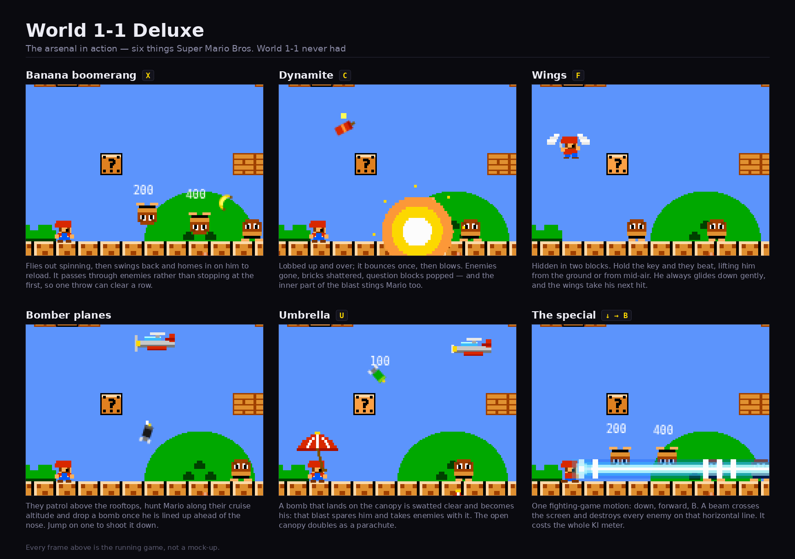

# Super Mario Bros. — World 1-1, with extras

A from-scratch recreation of World 1-1 in a single self-contained HTML file:
tile world, SMB-flavoured physics, goombas and koopas, breakable bricks, `?`
blocks, the warp pipe down to the coin room, and the flagpole. No assets, no
build step, no dependencies — every sprite is drawn with filled rectangles and
every sound is synthesised with the Web Audio API.

## Play

Open `mario.html` in a browser. That's all there is to it.

## Controls

| Key | |
| --- | --- |
| `←` `→` | move |
| `Space` / `↑` | jump |
| `Shift` / `Z` | run, and throw a fireball as Fire Mario |
| `↓` | crouch, or enter a pipe |
| `X` | throw a banana |
| `C` | lob a stick of dynamite |
| `F` | hold to fly, once you have the wings |
| `U` (or `E`) | hold to raise the umbrella |
| `↓` then `←`/`→` then `B` | the special |
| `R` | restart |

## What was added to 1-1

- **Banana boomerang** (`X`) — flies out spinning, loses speed, swings back and
  homes in on Mario, who catches it to reload. It passes straight through
  enemies, so one throw can clear a row for a rising combo. Two in the air at
  once.
- **Dynamite** (`C`) — lobbed up and over, bounces once and blows: clears
  enemies, shatters bricks, pops `?` blocks. The inner part of the blast hurts
  Mario too, so throw it and back off.
- **Wings** — hidden in two blocks. Hold `F` to beat them and climb, from the
  ground or from mid-air, for as long as you hold the key. Winged Mario always
  glides down gently, and the wings take the next hit for him.
- **Bomber planes** — they patrol above the rooftops, hunt Mario along their
  cruise altitude and drop a bomb once he is lined up ahead of the nose. Jump
  on one to shoot it down; bananas, fireballs and blasts work too.
- **Umbrella** (`U`) — a bomb that lands on the canopy is swatted clear and
  becomes Mario's: its blast spares him and takes enemies with it. The open
  canopy also works as a parachute. Both hands are on the handle, so no
  running and nothing to throw while it is up.
- **The special** (`↓`, forward, `B`) — entered as a fighting-game motion, the
  same Down-Forward-Punch that freezes people in Mortal Kombat. Mario plants
  his feet, gathers a ball of light and fires a beam across the screen that
  destroys every enemy on that horizontal line. It costs the whole KI meter
  under the score, which refills over about five seconds.

## Tuning

The constants sit next to the code they drive, near the top of each section:
`GRAVITY` / `WALK_MAX` / `RUN_MAX` for the feel of Mario himself, `BAN_*` for
the banana, `DYN_*` for dynamite, `FLY_*` for the wings (set `FLY_UNLIMITED`
to `false` for a metered version), `PLANE_*` and `BOMB_*` for the bombers,
`UMB_*` for the umbrella, and `SPEC_*` / `BEAM_*` for the special.
